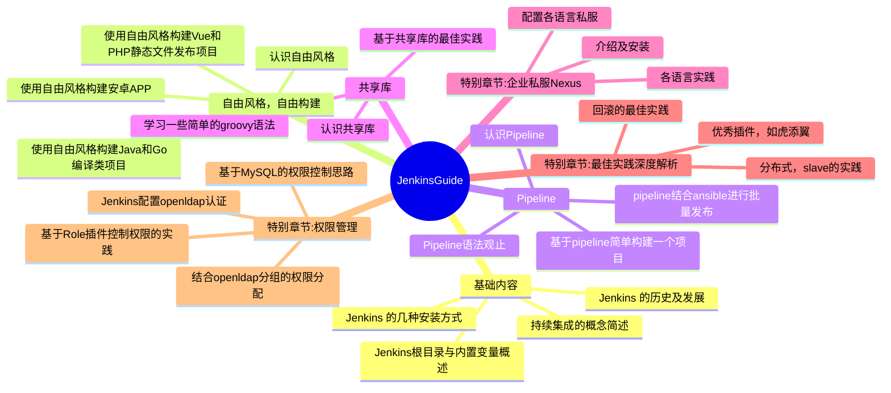

<h1>JenkinsGuild</h1>

 🧰 Jenkins全知全解 🧘

这里汇聚着我的聪明才智，展示着我的奇技巧思，君可安看。

指南大纲正在路上，欢迎各界能人异士贡献你与Jenkins相关的私密笔记。

<ul>
  <li><strong>我的博客</strong>: <a href="https://wiki.eryajf.net" target="_blank">https://wiki.eryajf.net</a></li>
  <li><strong>官方地址</strong>: <a href="https://www.jenkins.io" target="_blank">https://www.jenkins.io</a></li>
  <li><strong>访问指南</strong>: <a href="https://jenkinsguide.opsre.top" target="_blank">https://jenkinsguide.opsre.top</a></li>
  <li><strong>欢迎沟通</strong>: <a href="https://github.com/opsre/JenkinsGuide/issues" target="_blank">https://github.com/opsre/JenkinsGuide/issues</a></li>
</ul>

