```mermaid
mindmap
  root((JenkinsGuide))
    基础内容
      Jenkins 的历史及发展
      持续集成的概念简述
      Jenkins 的几种安装方式
      Jenkins根目录与内置变量概述
    自由风格，自由构建
      认识自由风格
      使用自由风格构建Java和Go编译类项目
      使用自由风格构建Vue和PHP静态文件发布项目
      使用自由风格构建安卓APP
    Pipeline
      认识Pipeline
      Pipeline语法观止
      基于pipeline简单构建一个项目
      pipeline结合ansible进行批量发布
    共享库
    	认识共享库
    	学习一些简单的groovy语法
    	基于共享库的最佳实践
    特别章节:企业私服Nexus
    	介绍及安装
    	配置各语言私服
    	各语言实践
    特别章节:最佳实践深度解析
    	回滚的最佳实践
    	优秀插件，如虎添翼
    	分布式，slave的实践
    特别章节:权限管理
    	Jenkins配置openldap认证
    	基于Role插件控制权限的实践
    	结合openldap分组的权限分配
    	基于MySQL的权限控制思路
```

<h1>JenkinsGuide</h1>

[![Auth](https://img.shields.io/badge/Auther--eryajf-ff69b4.svg?logo=data:image/png;base64,iVBORw0KGgoAAAANSUhEUgAAADIAAAAyCAYAAAAeP4ixAAAACXBIWXMAAAsTAAALEwEAmpwYAAADZElEQVR4nO2ZX2iPURjHP/7/aZN/E21DaZvtwoVYyQUuGXLB/LtkLRcUhSJMSVwg3KCUJPJvLmRZtMQFLvwZhUJk/saGLWaYV6eet06n9/3tfd+9531/sW89td9z3vOc8z3nPOc8zzPoQQ+yAnlAA/AbcCzKR2ClTSL7LRNwNPkB5Noi0pggEQeYbovIh4SJLLBBojfwK2EiVTaIjEyYhANsskGkNAUi+2wQmZECkRM2iCxMgUi9DSKrxPhS7GOZjHXPhvGtYlwdMduYKWO9tmH8oBgvxj6KZawOoFfcxk+L8RzsI0fzkyFhO28EvqXg0FHlK1DtReRzFkzOCSmfvIhczIKJOSHlmheRgcAK4E4WTNDpQp4Ba4P4zxRgO3ArgSQqqDQDx4AKCWBDYwSwRDP4JWECG4CpQB9iwCTNsBsJl8srvxk4CtQBN4Enkre0GKQ7RaekCXgAXAcuAHuB1bLaZcAgrd+2uK78ai0PsfLSBshG70u9IDJmyUq2AYvlbD5N4Dg9l/EnArdFV9sdIlfEiLrNzFAlqPwE2kP2OaKNlyfH8Q9QFJVIixgepukqIuTdRRI3Be1TaczjnOgXRSXyTgwUarrBIVb4htbvcMA+nR7+UCdtc6MSOS8G9hj6+gjlnHEBd+WuMVaZ9FMyJiqRydrgB4B80VcFmFBtxALfFm3nlwPv48rfK7WoWDkc8jgpYq0eE/kOnAGG+4RBh3z6qTGOyzfIJeG2nQL6EQMmaEaTgtNdv+jKcFJwbI33XxEpAM76+IArrXIbFqVFpE0MuzeXF4nmEI9ecwZbhVo6GzsaxLhnniw74YQUVdDwwjppv2yzaPbIJ7HJdJz8RIX5JgYAL6V9vg0ifYEXMsAaj3Z3cpfkmPmhQAs5vHxgh+gbbdS0XMyTQdrkbdHhTiwTCdMHTCLl8hCqeGsalnFSO2JDNb3XxOZINqhkttFmfq8W4I1PbGcFuVr21qCloe7EarRvmzT9K01fYxAZJVmgA1yNKxwh4NF4q0Wr+UZs5JIxndskoVLoEskI1e/HRu6TCEpklR1ZebPcqk/YT9cu1UL190NgNCmhQGpfTjelLo2dMNEf2BkylXVF7eL6qAU3WyiVvCHIv7A7pBY2nizGWGC3FOr0XeoQZ96VIcbqAf8K/gLNGaTJ3vwbFgAAAABJRU5ErkJggg==)](https://github.com/eryajf)

 🧰 Jenkins全知全解 🧘

这里汇聚着我的聪明才智，展示着我的奇技巧思，君可安看。

指南大纲正在路上，欢迎各界能人异士贡献你与Jenkins相关的私密笔记。

<ul>
  <li><strong>我的博客</strong>: <a href="https://wiki.eryajf.net" target="_blank">https://wiki.eryajf.net</a></li>
  <li><strong>官方地址</strong>: <a href="https://www.jenkins.io" target="_blank">https://www.jenkins.io</a></li>
  <li><strong>访问指南</strong>: <a href="https://jenkinsguide.opsre.top" target="_blank">https://jenkinsguide.opsre.top</a></li>
  <li><strong>欢迎沟通</strong>: <a href="https://github.com/opsre/JenkinsGuide/issues" target="_blank">https://github.com/opsre/JenkinsGuide/issues</a></li>
</ul>

## 项目源码

可选择你熟悉的平台浏览源码：

|   服务商   |                   地址                   |
| :------: | :------------------------------------------: |
|  `CNB`  | <https://cnb.cool/opsre/JenkinsGuide>  |
| `GitHub` | <https://github.com/opsre/JenkinsGuide> |