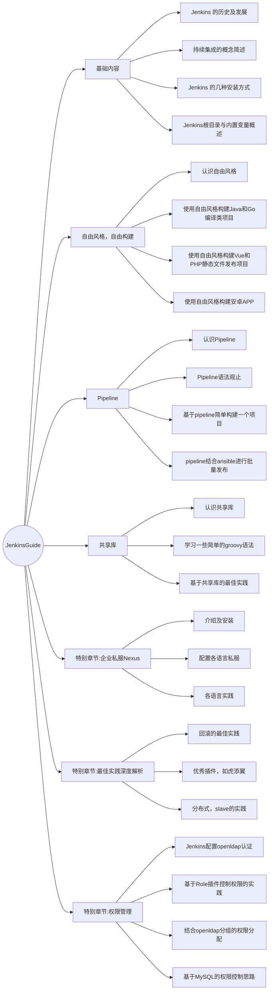

<HomeUnderline />

<confetti />

---

```mermaid
graph LR
    A((JenkinsGuide)) --> B[基础内容]
    A --> C[自由风格，自由构建]
    A --> D[Pipeline]
    A --> E[共享库]
    A --> F[特别章节:企业私服Nexus]
    A --> G[特别章节:最佳实践深度解析]
    A --> H[特别章节:权限管理]

    B --> B1[Jenkins 的历史及发展]
    B --> B2[持续集成的概念简述]
    B --> B3[Jenkins 的几种安装方式]
    B --> B4[Jenkins根目录与内置变量概述]

    C --> C1[认识自由风格]
    C --> C2[使用自由风格构建Java和Go编译类项目]
    C --> C3[使用自由风格构建Vue和PHP静态文件发布项目]
    C --> C4[使用自由风格构建安卓APP]

    D --> D1[认识Pipeline]
    D --> D2[Pipeline语法观止]
    D --> D3[基于pipeline简单构建一个项目]
    D --> D4[pipeline结合ansible进行批量发布]

    E --> E1[认识共享库]
    E --> E2[学习一些简单的groovy语法]
    E --> E3[基于共享库的最佳实践]

    F --> F1[介绍及安装]
    F --> F2[配置各语言私服]
    F --> F3[各语言实践]

    G --> G1[回滚的最佳实践]
    G --> G2[优秀插件，如虎添翼]
    G --> G3[分布式，slave的实践]

    H --> H1[Jenkins配置openldap认证]
    H --> H2[基于Role插件控制权限的实践]
    H --> H3[结合openldap分组的权限分配]
    H --> H4[基于MySQL的权限控制思路]
click B3 "https://jenkinsguide.opsre.top/basicContent/how-to-install" _blank
```

